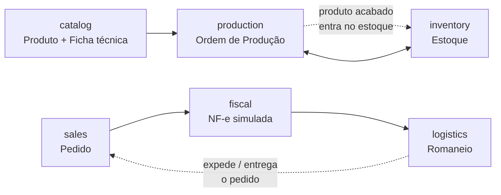

# production-erp-api

ERP de manufatura (produção de alimentos) em **Java 21 + Spring Boot** —
projeto de portfólio inspirado num ERP de fábrica: pedidos, estoque, ordem
de produção com retirada de insumos por ficha técnica, nota fiscal e
expedição.

> ⚠️ **Objetivo**: portfólio/estudo, com foco em arquitetura e qualidade de
> código — não é (e não pretende ser) um sistema pronto pra produção numa
> empresa real.

> ⚠️ **NF-e é SIMULADA.** Este projeto **não** transmite nada à SEFAZ, não
> usa certificado digital (A1/A3) e a "chave de acesso" gerada é só um
> número de 44 dígitos aleatório — não é uma chave real nem validável. O
> cálculo de ICMS/PIS/COFINS usa alíquotas fixas simplificadas (numa NF-e
> real elas variam por NCM, CFOP, regime tributário e UF de
> origem/destino). Ver Javadoc de `InvoiceService` para detalhes.

## Stack

- **Java 21** + **Spring Boot 3.3.4** (Maven)
- **PostgreSQL** + **Flyway** (migrations versionadas, `ddl-auto: validate`)
- **Spring Data JPA** (Hibernate)
- **Spring Security + JWT** (access token 15min / refresh token 7d)
- **Bean Validation** nos DTOs de entrada
- **MapStruct** (Entity ↔ DTO) e **Lombok**
- **springdoc-openapi** — Swagger UI em `/swagger-ui.html`
- **JUnit 5 + Mockito** (testes de unidade) e **Testcontainers** (testes de
  integração com Postgres real via Docker)

## Arquitetura

Pacote raiz `com.hlima.erp`, organizado **por módulo de domínio**
(package-by-feature), cada um com suas próprias camadas internas
(`entity` / `dto` / `repository` / `service` / `mapper` / `controller`):

```
com.hlima.erp
 ├── shared/       BaseEntity, exceções, ApiError, config de segurança/OpenAPI
 ├── auth/         User, login/refresh JWT
 ├── catalog/      Product, BillOfMaterial (ficha técnica)
 ├── inventory/    Warehouse, StockItem, StockMovement
 ├── sales/        Customer, Order (pedido)
 ├── production/   ProductionOrder (ordem de produção)
 ├── fiscal/       Invoice (NF-e simulada)
 └── logistics/    Vehicle, Driver, DeliveryManifest (romaneio)
```

Um único módulo Maven (simples de rodar/buildar), mas com separação clara
por bounded context — sem cair no exagero de microsserviços pra um projeto
de portfólio.

### Ficha técnica em múltiplos níveis

Produto tem três tipos (`ProductType`): **matéria-prima**, **semi-acabado**
e **produto acabado**. Só matéria-prima não passa por ordem de produção nem
tem ficha técnica — semi-acabado tem os dois, exatamente como um produto
acabado (é "produzido" a partir da própria ficha técnica e dá entrada em
estoque), com a diferença de que também pode ser insumo da ficha técnica de
outro produto. Isso permite BOM em cadeia (ex: farinha + fermento + sal →
**massa de pizza** [semi-acabado, com OP própria] → **mini pizza de queijo**
[acabado, cuja ficha técnica usa massa de pizza + queijo]).

`BillOfMaterialService.save` valida cada insumo: não pode ser o próprio
produto, não pode ser produto acabado (nada usa um acabado como insumo), e
— por causa da cadeia de múltiplos níveis — não pode já depender (direta ou
indiretamente, seguindo a ficha técnica dele recursivamente) do produto que
está recebendo a ficha, senão formaria um ciclo.

### Fluxo entre módulos



O ciclo completo de um pedido:

```
RASCUNHO → CONFIRMADO → EM_SEPARACAO → FATURADO → EXPEDIDO → ENTREGUE
                                (ou CANCELADO até EM_SEPARACAO)
```

- `FATURADO` é setado pelo módulo **fiscal** ao emitir a NF-e simulada.
- `EXPEDIDO` é setado pelo módulo **logistics** ao incluir o pedido num
  romaneio.
- `ENTREGUE` é setado ao concluir a rota do romaneio.

Toda alteração de saldo de estoque passa **sempre** por
`StockService.applyMovement` (nunca um update direto de quantidade) — é o
que o módulo `production` chama pra retirar insumos e dar entrada do
produto acabado.

## Como rodar

### 1. Banco de dados

```bash
docker compose up -d
```

Sobe um Postgres 16 local (`erp_producao` / usuário e senha `erp`).

### 2. Aplicação

```bash
mvn spring-boot:run
```

Variáveis de ambiente (todas com default sensato pra rodar local, ver
`application.yml`): `DB_HOST`, `DB_PORT`, `DB_NAME`, `DB_USER`,
`DB_PASSWORD`, `JWT_SECRET`, `PORT`.

A aplicação sobe em `http://localhost:8080`. As migrations do Flyway rodam
automaticamente e já seedam:
- Um usuário **ADMIN**: `admin@erp.com.br` / `Admin@123`
- Um almoxarifado padrão: `CD` (CD Fábrica)

### 3. Explorar a API

Swagger UI: **http://localhost:8080/swagger-ui.html**

Todos os endpoints (exceto `/auth/login`, `/auth/refresh` e os do próprio
Swagger) exigem `Authorization: Bearer <accessToken>`, obtido em
`POST /auth/login`.

## Deploy (Render)

Repositório inclui `Dockerfile` (multi-stage: build com Maven, runtime só
com JRE) e `render.yaml` (Blueprint) pra criar o banco Postgres e o Web
Service num passo só:

1. No [Render](https://dashboard.render.com), **New +** → **Blueprint** →
   selecione este repositório. Ele lê o `render.yaml` e cria o Postgres
   (`erp-producao-db`) e o Web Service (`erp-producao-api`) já conectados
   (as credenciais do banco viram env vars automaticamente via
   `fromDatabase`).
2. `JWT_SECRET` é gerado automaticamente pelo Render nesse passo (não usa
   o placeholder de dev do `application.yml`).
3. Depois de fazer o deploy do frontend (Vercel — ver o README do
   [`production-erp-web`](https://github.com/hlima-dev/production-erp-web)),
   volte aqui e atualize a env var `CORS_ALLOWED_ORIGINS` no Web Service
   com a URL real da Vercel (ex: `https://production-erp-web.vercel.app`)
   — sem isso o navegador bloqueia as chamadas por CORS. Redeploy manual
   depois de salvar.
4. `healthCheckPath: /actuator/health` no Blueprint faz o Render esperar a
   aplicação (e as migrations do Flyway) subirem antes de rotear tráfego.

Free tier do Render "dorme" o Web Service após um período sem requisições
— o primeiro acesso depois disso demora ~30-50s (cold start) enquanto ele
acorda.

## Módulos e endpoints

| Módulo | Endpoints principais |
|---|---|
| **auth** | `POST /auth/login`, `POST /auth/refresh`, `POST /auth/logout`, `POST /auth/register` (ADMIN) |
| **catalog** | `GET/POST/PUT/DELETE /products`, `GET/PUT /products/{id}/bom` (ficha técnica) |
| **inventory** | `GET/POST /warehouses`, `GET /inventory/stock`, `POST /inventory/movements` |
| **sales** | `GET/POST/PUT /customers`, `DELETE /customers/{id}`, `GET/POST/PUT /orders`, `POST /orders/{id}/{confirm,separation,deliver,cancel}` |
| **production** | `GET/POST /production-orders`, `POST /production-orders/{id}/{start,complete,cancel}` |
| **fiscal** | `GET/POST /invoices`, `POST /invoices/{id}/cancel` |
| **logistics** | `GET/POST /vehicles`, `GET/POST /drivers`, `GET/POST /delivery-manifests`, `POST /delivery-manifests/{id}/{start,complete}` |

Papéis: **ADMIN** (cadastros administrativos: produtos, almoxarifados,
veículos/motoristas, registrar usuário) e **OPERADOR** (operação do
dia a dia: pedidos, estoque, produção, faturamento, expedição).

## Fluxo de ponta a ponta (exemplo manual pelo Swagger)

1. Criar produto **matéria-prima** (ex: farinha) e um **produto acabado**
   (ex: pão) com preço.
2. `PUT /products/{id}/bom` do produto acabado — definir a ficha técnica
   (quanto de insumo por unidade produzida).
3. `POST /inventory/movements` — entrada de estoque da matéria-prima.
4. `POST /customers` + `POST /orders` — criar um pedido do produto acabado.
5. `POST /orders/{id}/confirm` → `POST /orders/{id}/separation`.
6. `POST /production-orders` pro produto acabado → `.../start` (retira o
   insumo calculado pela ficha técnica) → `.../complete` (dá entrada do
   produto acabado no estoque).
7. `POST /invoices` com o `orderId` — emite a NF-e simulada (pedido vira
   `FATURADO`).
8. `POST /vehicles`, `POST /drivers`, `POST /delivery-manifests` incluindo
   o pedido faturado (pedido vira `EXPEDIDO`) → `.../start` → `.../complete`
   (pedido vira `ENTREGUE`).

## Testes

```bash
mvn test      # unidade (StockService, ProductionOrderService, InvoiceService)
mvn verify    # unidade + integração (Testcontainers — precisa de Docker)
```

Testes de unidade cobrem os dois fluxos mais críticos do projeto:
- **Baixa/entrada de estoque** (`StockServiceTest`, `ProductionOrderServiceTest`):
  cálculo correto da quantidade de insumo a retirar (ficha técnica ×
  quantidade planejada), validação agregada de saldo insuficiente antes de
  retirar qualquer insumo, e entrada do produto acabado ao concluir a OP.
- **Cálculo de impostos simplificado** (`InvoiceServiceTest`): ICMS/PIS/COFINS
  batendo exatamente com as alíquotas fixas documentadas, e formato da
  chave de acesso simulada (44 dígitos).

Há também um teste de integração (`ProductionOrderFlowIT`) que sobe um
Postgres real via Testcontainers e roda o fluxo completo de produção por
HTTP — só roda em `mvn verify` com Docker disponível (excluído do `mvn test`
via `maven-surefire-plugin`, incluído no `mvn verify` via
`maven-failsafe-plugin`).

## Decisões e simplificações conscientes

- **NF-e simulada** — ver aviso no topo deste README.
- **Cancelamento de ordem de produção** só é permitido enquanto ainda está
  `ABERTA` (nenhum insumo retirado). Estornar uma OP já `EM_PRODUCAO`
  exigiria reverter as retiradas já feitas — fora do escopo deste projeto.
- **Primeira movimentação de estoque de um produto/almoxarifado**: existe
  uma janela teórica de corrida entre duas requisições concorrentes
  criando o mesmo `StockItem` pela primeira vez (constraint única evita
  duplicidade, mas um upsert atômico seria mais robusto). Aceitável pro
  escopo de portfólio.
- **Cancelamento de NF-e** só troca o status — sem evento de cancelamento
  real nem reversão automática do pedido faturado.
